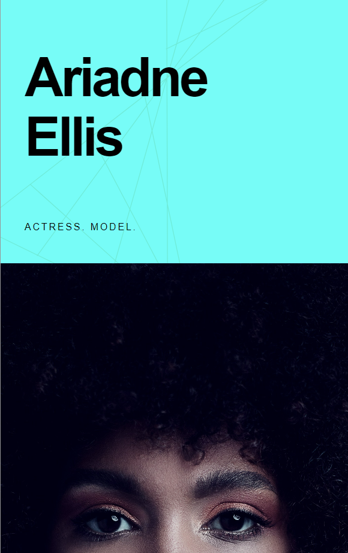
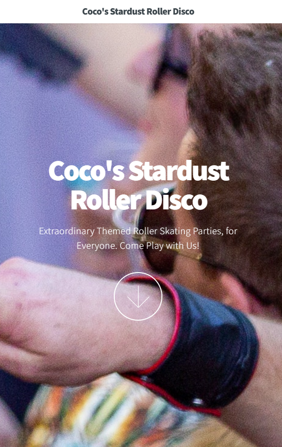

  
  
  
  
  

Software engineer based in New York City, nurturing my passion for solving challenges by programming things for the web. Previously I enjoyed gaining experience in corporate project & event management, as well as performing on several NYC and regional stages. 

I've developed a set of skills that is uniquely suited to the web development and data analysis spaces - improving systems and processes, making content decisions, and working with a diverse group of people to achieve a goal.

See [my website](https://mariesmith.netlify.app/) for more information!

<!-- Projects: Met Museum, Portfolio, Roller Rink, Actress: -->
<h1 align="center">Projects</h1>
<table bordercolor="#66b2b2">
  
  <tr>
    <td width="50%" valign="top">
      <h3 align="center">ariadne-ellis.com</h3>
         
        
         
        

          
    
  
      

        
<strong>Javascript, HTML, CSS</strong> - Elegant and easy–to–view website showcasing a professional artist.

    </td>

<td width="50%" valign="top">
      <h3 align="center">Portfolio site</h3>
         
        
         
        

          
  
  
      

        
<strong>Javascript, HTML, CSS</strong> - Portfolio Site including links to my projects and ways to get in contact with me.

    </td>
  </tr>
  
</table>

<h1 align="center">Technologies</h1>

    
    
    <!--  -->
    <!--  -->
    
    <!--  -->
    <!--  -->
    <!--  -->
    <!--  -->
    <!--  -->
    <!--  -->
    <!--  -->
    <!--  -->
    <!--  -->
    
    
    <!--  -->
    
    
    <!--  -->

---

<h1 align="center">Connect</h1>

  
  
  
  
  

